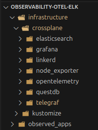
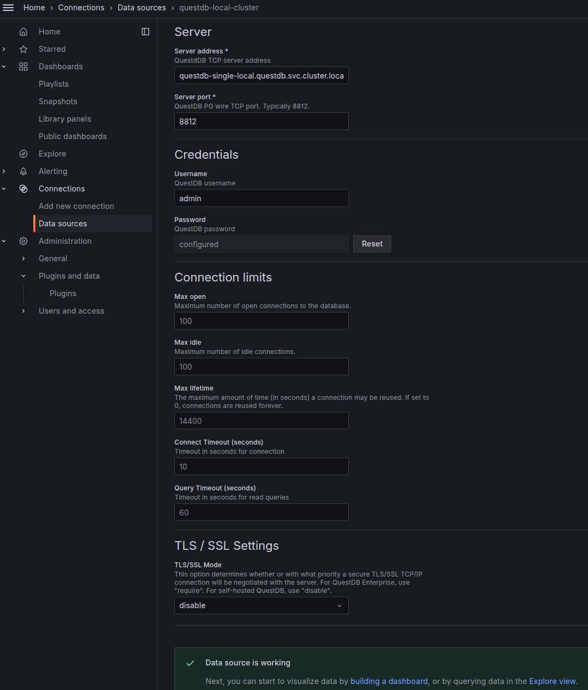
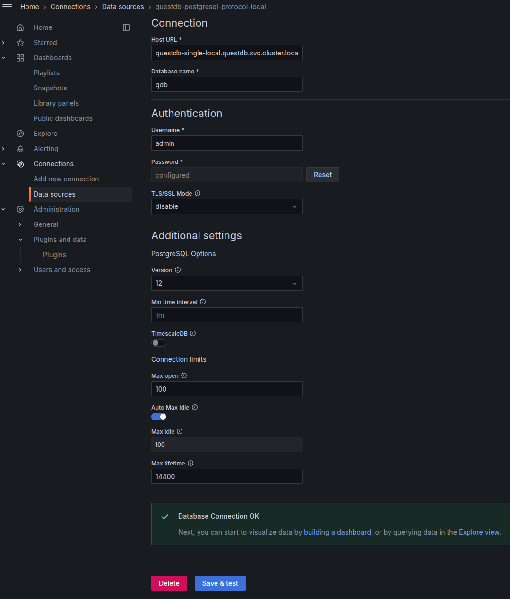
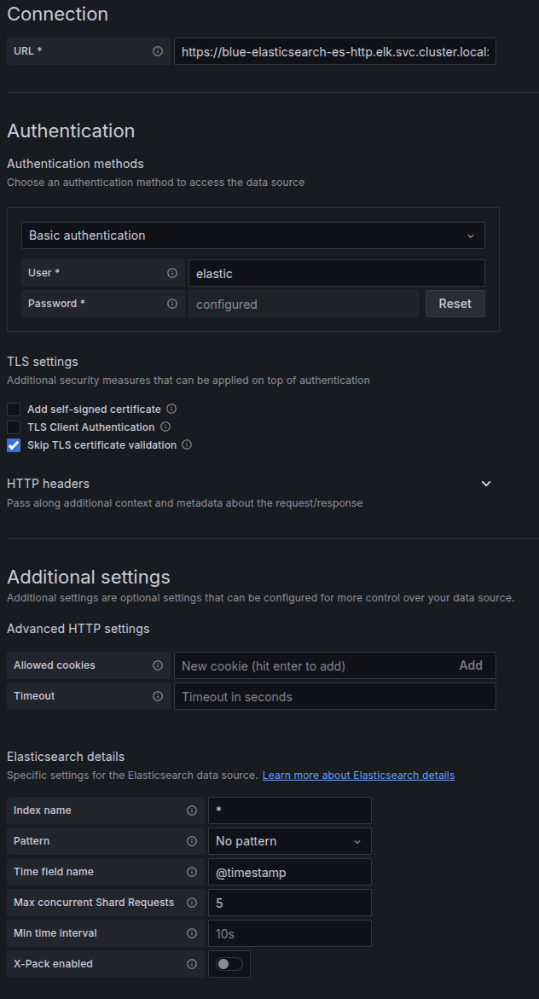

# Observability in Kubernetes with Opentelemetry and Elasticsearch

Observability is crucial for maintaining an application in production. The goal of this repository is to create an observability system when deploying applications using Kubernetes.

## Technologies Used

#### Platforms and Tools
 

 
 

#### Programming Languages and Frameworks

#### Infrastructure

- **OpenTelemetry**: Generates traces, metrics, and logs.
- **Node Exporter**: Collects metrics related to the state of the Kubernetes cluster.
- **Elasticsearch**: Centralizes traces, metrics, and logs in a single tool. It serves as a replacement for Zipkin or Jaeger for monitoring traces while also allowing log correlation without additional configuration.
- **QuestDB**: Used as a time-series database to store metrics instead of deploying an additional component like Prometheus.
- **Grafana**: Used for visualization, with QuestDB as the data source.

    

## Architecture Overview

1. **Tracing and Logging**: OpenTelemetry is used to generate and send traces, logs, and metrics to Elasticsearch. This setup enables automated correlation between logs and traces without requiring extra configuration.
2. **Cluster Metrics**: Node Exporter collects Kubernetes cluster metrics.
3. **Time-Series Metrics**: Instead of using Prometheus, this project stores metrics in QuestDB, demonstrating an alternative approach for monitoring.
4. **Application Instrumentation**:
   - A **Java/Spring Boot** application is instrumented to generate observability data.
   - A **Python** application is also instrumented, following the same procedure.

## Why Not Use Prometheus?

Prometheus is the standard monitoring solution, with extensive tutorials available. However, in this project, we assume an existing time-series database such as **Timescale, InfluxDB, or QuestDB** (in this case, QuestDB). By leveraging QuestDB, we avoid deploying an additional component.

## Visualization

Grafana is used for monitoring, configured to use QuestDB as the data source for querying and visualizing metrics.

## Getting Started

To set up and deploy the observability system, follow these steps:

1. Deploy the required components using Crossplane (Elasticsearch, QuestDB, Grafana, Opentelemetry Collector, Telegraf, Node Exporter).
2. Configure OpenTelemetry to send traces, logs, and metrics.
3. Instrument and deploy your applications in Java, Python, or other languages.
4. Use Grafana to visualize data stored in QuestDB.

This approach provides a unified observability solution tailored for Kubernetes deployments, simplifying traceability and monitoring without additional complexity.

## Grafana Configuration

To use **Grafana** with **QuestDB**, follow these [Steps](https://questdb.com/docs/third-party-tools/grafana/):

1. **Install the QuestDB Plugin**  
   First, add the [QuestDB plugin](https://grafana.com/grafana/plugins/questdb-questdb-datasource/) to Grafana. This will allow you to configure QuestDB as a data source.

2. **Configure the QuestDB Data Source**  
   Once the plugin is installed, create a new **QuestDB Data Source** with the following credentials:  
   - **Username**: `admin`  
   - **Password**: `quest`  
   
   

3. **Postgres Data Source for Grafana Dashboards**  
   Since QuestDB supports the **PostgreSQL protocol**, we will also create a **Postgres Data Source** pointing to QuestDB. This enables us to use existing Grafana dashboards that require a PostgreSQL-compatible database.  

   

4. **Elasticsearch Configuration**  
   Additionally, configure Elasticsearch as a data source to visualize logs and traces in Grafana.

   

With these configurations, Grafana will be ready to visualize traces, logs, and metrics stored in **QuestDB** and **Elasticsearch**.

